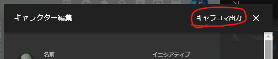

# Copy CCFOLIA Character to Clipboard Expansion
## 概要
「Copy CCFOLIA Character to Clipboard Expansion」は、[スピアール様](https://twitter.com/Spealthon)よりご提供されている「[Copy CCFOLIA Character to Clipboard Bookmarklet (C4 Bookmarklet)](https://twitter.com/Spealthon/status/1524041818929004545)」を、Google Chrome 拡張機能として使用可能にしたものです。

- できること
  - キャラクターコマの情報をクリップボード貼り付けることができます。
  - クリップボードに貼り付けたキャラクターコマの情報は、ココフォリアのルーム上で「右クリック -> 『貼り付け』」or「Ctrl + v」でキャラクターコマとしてルーム上に作成することができます。

## 導入方法
1. ソースコードのダウンロード
  - GitHubリポジトリ「Copy-CCFOLIA-Character-to-Clipboard-Expansion」より、ソースコードをダウンロードします。
  1. GitHubリポジトリ「[Copy-CCFOLIA-Character-to-Clipboard-Expansion](https://github.com/LyriDev/Copy-CCFOLIA-Character-to-Clipboard-Expansion)」をブラウザで開きます。
  2. 「<> Code ▼」ボタンをクリックします。
    - メニューが開かれます。
  3. 開かれたメニューより、「Download ZIP」をクリックします。
    - zipファイルとしてソースコードがダウンロードされます。
  4. ダウンロードしたzipファイルを解凍します。
    - 解凍後のフォルダー(Copy-CCFOLIA-Character-to-Clipboard-Expansion-main)は今後、恒常的に使用します。Downloadフォルダー以外の別のフォルダーに移しておくと良いかもしれません。
2. ソースコードのビルド
  1. 解凍したフォルダーを右クリックし、「ターミナルで開く」をクリックしてコマンドプロンプトを起動します。
  2. Javascriptのビルドを行うために、Node.jsという実行環境をPCにインストールします。
    - [こちら](https://qiita.com/taiponrock/items/9001ae194571feb63a5e)を参考に、Node.js / npmをインストールしてください。
  3. カレントディレクトリが`Copy-CCFOLIA-Character-to-Clipboard-Expansion-main`になっていることを確認した後、以下のコマンドを実行します。
    1. `npm i`
      - 必要なモジュールをインストールします。
    2. `npm run build`
      - ソースコードをビルドします。
  4. 「Copy-CCFOLIA-Character-to-Clipboard-Expansion-main」フォルダー内に「dist」フォルダーが生成されたことを確認します。
3. 拡張機能の読み込み
  - [こちら](https://note.com/cute_echium873/n/n997dcf40b3a1)を参考に、ローカルの拡張機能を読み込みます。
  1. ブラウザを開きます。(今回はChrome)
  2. 「画面右上の『︙』ボタン」->「拡張機能」->「拡張機能を管理」の順でクリックし、拡張機能管理画面を開きます。
  3. 拡張機能管理画面が開いたら、右上にある「デベロッパーモード」をオンにします。
  4. 「パッケージ化されていない拡張機能を読み込む」をクリックします。
  5. フォルダー選択画面が開くので、[2-4]で確認した「dist」フォルダーを選択します。
  6. 拡張機能「Copy-CCFOLIA-Character-to-Clipboard-Expansion」がブラウザの拡張機能として読み込まれます。

## 使い方
1. キャラクターコマをダブルクリックし、キャラクター編集画面を開く
2. キャラクター編集画面上部の「キャラコマ出力」ボタンをクリックする
  
  - クリップボードにキャラクターコマの情報が貼り付けられる
3. 出力されたキャラクターコマを貼り付けたいルームを開く
4. ルーム上で「Ctrl + v」を押す
5. 出力されたキャラクターコマがルーム上に貼り付けられる

## 注意
- この拡張機能は開発者が個人使用を目的として開発したものになります。
  - ココフォリアのアップデート等により拡張機能が動作しなくなることがあることをご了承ください。
  - ご連絡の際は[こちら](https://twitter.com/Lyri_TheHound)よりお願いします。
- C4 Bookmarkletと一部異なる点がございます。
  - キャラコマ出力時、現在ルームチャット欄で選択中のキャラクター名が出力キャラ名に変更されます。
    - これはC4 Bookmarkletとは異なり、C4 Expansionではキャラクターカラーを取得しているためとなります。
    - ただし、自身が所有しているキャラクター以外のキャラクターカラーは取得できないことをご了承ください。
- その他注意事項は、C4 Bookmarkletと基本同一となります。
  - こちらはココフォリア公式様への許諾を取っていない、非公式のスクリプトとなります。
  - お使いの環境やココフォリアの将来のアップデートで動作しなくなることが予想されます。その場合の動作の保証はしかねますので、ご利用の際は自己責任でお願いいたします。
  - また本スクリプトが動作不良を起こした場合などで、ココフォリア公式様へのお問い合わせ等はお控え下さい。
  - 非公式制作物である以上、公式様より通告を頂いた場合、即刻公開を停止させて頂きます。その場合、利用をお辞め頂くようお願い申し上げます。
